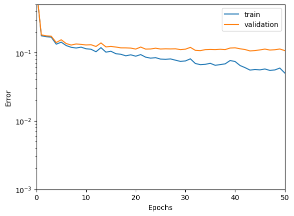
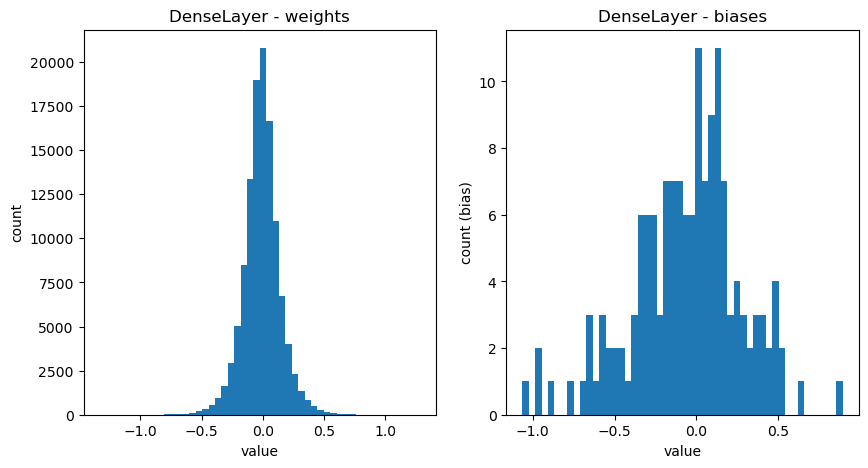
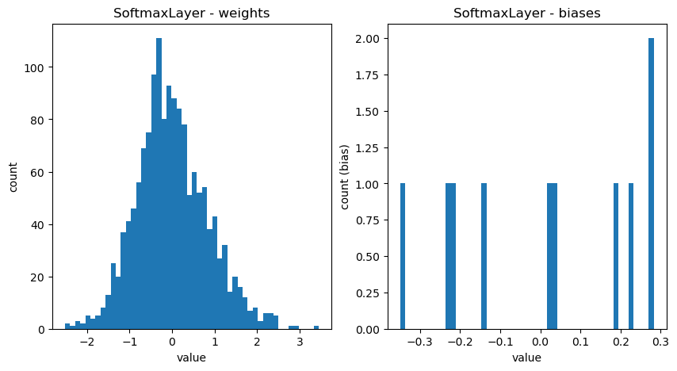
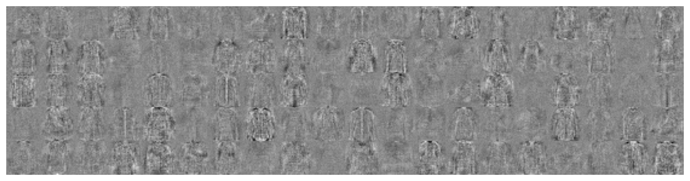
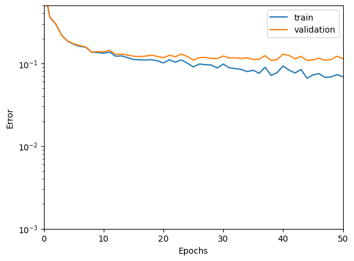
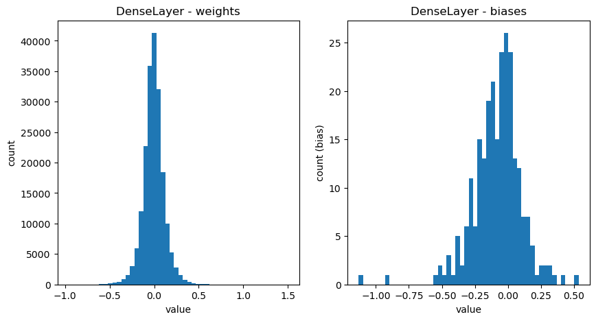
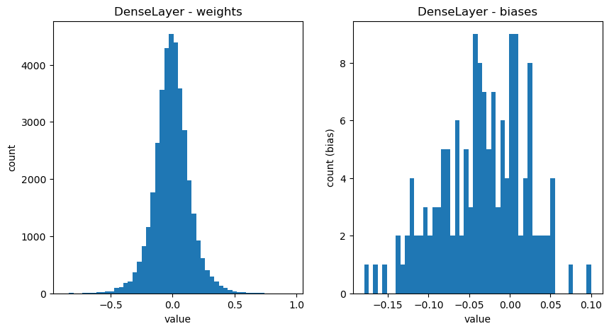
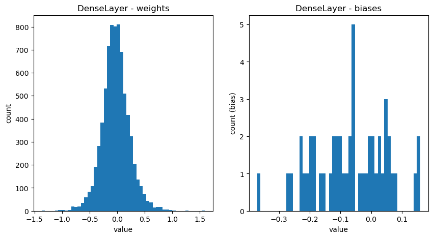
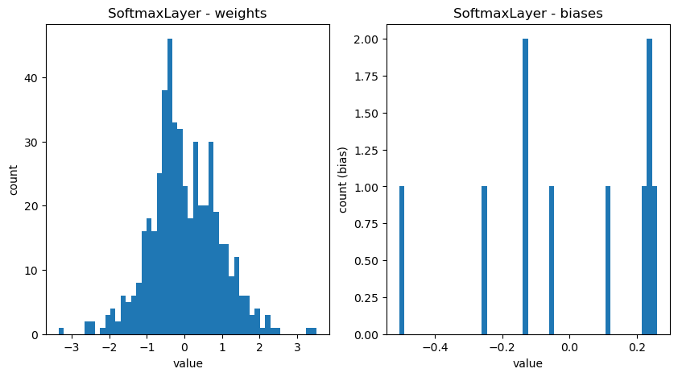
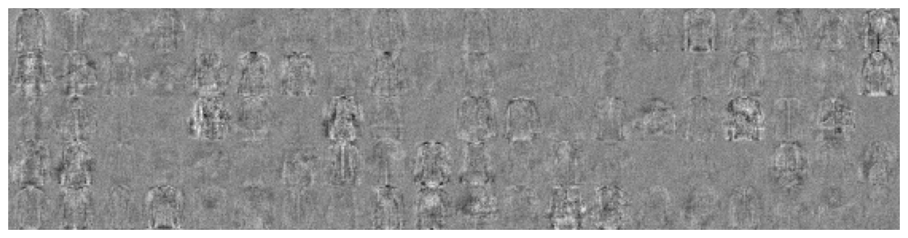

# Exercise 3 Train FashionMNIST

We will run two experiments:

Shallow Network : Single hidden layer layer with 150 units

Deeper Network : Three hidden layers with 250, 150, 50 hidden layers.

> What are suitable learning rates, batch sizes, number of epochs ? Describe your findings including the achieved test error rates and the learning curves.

## Shallow Network

test error rate: 10.84 % out of 14000

## Deeper Network

test error rate: 11.88 % out of 14000

## Conclusion

We tried to use these parameters for both shallow and deeper networks:

epochs = 50
batchsize = 16
learning_rate = 0.1

We found that the shallow network performed better than the deeper network. The test error rate for the shallow network was 10.84% and for the deeper network was 11.88%. Therefore, a smaller network is able to perform better than a deeper network because the deeper network is more prone to overfitting and the task of classifying images is not complex enough to require a deeper network.
