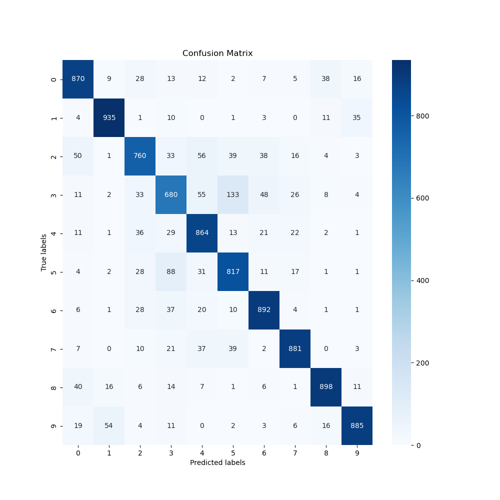

# Practical Work 8

## Exercice 1

The objective was to explore the performance of a deep VGGNet-inspired CNN on the CIFAR10 dataset.

### Dataset

This dataset includes images of 10 different object categories, each of size 32x32 pixels.

### Model Architecture

The model was structured using the following architecture:

```txt
[
    [Conv2D → relu → BN]*3 
    → MaxPool2D 
    → Dropout
]*4 
→ Flatten 
→ Dense 
→ Dropout
→ Out
```

### Training

The model was trained using the following hyperparameters:

```txt
batch_size = 512
num_epochs = 20
learning_rate = 0.001
```

Training was managed with PyTorch Lightning, which handle hardware acceleration and simplifies the training loop. The model was trained on a single NVIDIA GeForce RTX 2080 Super GPU.

### Logging and Monitoring

Training progress was monitored using TensorBoard, which logged metrics such as training and validation loss. Additionally, a confusion matrix and classification report were generated at the end of testing to evaluate model performance across different classes

### Evaluation

Here are the results of the model evaluation:

|   Classe  | precision | recall | f1-score | support |
| --- | --------- | ------ | -------- | ------- |
| 0   | 0.854     | 0.886  | 0.869    | 1000.0  |
| 1   | 0.911     | 0.946  | 0.928    | 1000.0  |
| 2   | 0.842     | 0.749  | 0.793    | 1000.0  |
| 3   | 0.732     | 0.732  | 0.732    | 1000.0  |
| 4   | 0.824     | 0.838  | 0.831    | 1000.0  |
| 5   | 0.800     | 0.766  | 0.783    | 1000.0  |
| 6   | 0.883     | 0.887  | 0.885    | 1000.0  |
| 7   | 0.860     | 0.918  | 0.888    | 1000.0  |
| 8   | 0.932     | 0.906  | 0.919    | 1000.0  |
| 9   | 0.908     | 0.922  | 0.915    | 1000.0  |
|     |           |        |          |         |
| accuracy      |           |        | 0.855    |         |
| macro avg     | 0.855     | 0.855  | 0.854    | 10000.0 |
| weighted avg  | 0.855     | 0.855  | 0.854    | 10000.0 |



### Conclusion

The model achieved an accuracy of 85.5% on the CIFAR10 dataset, which is the upperbound of the performance awaited. Considering a simple network architecture trained in a reasonable amount of time (3min on a 2080 super), this result is quite good. However, the model could be further improved by tuning hyperparameters, increasing the number of epochs, or using more advanced architectures like residual inception blocks or 1x1 convolutions.

## Exercice 2

The paper extends the modular and efficient design of inception blocks by integrating the advantages of residual connections. Therefore, they introduce residual inception blocks, which are convolutional layers with varying kernel sizes operating at the same level within the network. These modules allow the network to capture information at multiple scales. Furthermore, 1x1 convolutions are employed to reduce the number of parameters compressing the channels and thus increasing the efficiency of the network.

### Comparison

- **ResNet (Residual Network)**: The key innovation in ResNet is the use of residual connections, which help in training deeper networks by allowing gradients to flow through a shortcut connection that skips one or more layers. The Inception-ResNet models discussed in the paper incorporate this idea into the Inception framework, merging Inception’s efficient mixed convolutions with ResNet’s residual connections to boost performance and speed up training
- **GoogleNet (Inception-v1)**: The inception models, including Inception-v4 and the Inception-ResNets, are direct descendants of GoogleNet. They expand upon GoogleNet’s idea of an efficient convolutional network architecture with multiple "Inception modules" that perform convolutions of different sizes in parallel within the same module. The newer versions, like Inception-v4, simplify and enhance this modular architecture further, maintaining high efficiency while increasing depth and width of the network

## Exercice 3

### Hierarchical features with CNN

Convolutional Neural Networks (CNNs) learn features at different levels of abstraction thanks to the hierarchical structure of the network. The deeper the layer, the more abstract the features learned. For example, the first layers of a CNN might learn simple features like edges and textures, while deeper layers learn more complex features like object parts or entire objects.

All these architectures introduces significant innovations. For instance:

- **AlexNet**: Introduction of ReLU activation functions, first deep learning based approach to win the ImageNet competition (deeper, bigger, and more powerful than LeNet), 60M parameters
- **VGGNet**: Simplicity and uniformity in architecture, with 3x3 convolutional layers and 2x2 pooling layers (Small filters, deeper networks), Able to understand non-linear features, 138M parameters
- **GoogleNet**: Inception modules (1x1 convolutions, concatenate all filters outputs together depth-wise), 22 layers deep, 4M parameters, intution: (mix filter size to allow looking for more or less details from the previous layer, i.e. related to the receptive field size)
- **ResNet**: Hypothesis: deeper models are more difficult to optimize, introduce Residual connections (skip connections), 152 layers deep, 25M parameters, (reduce the number of parameters), Xavier initialization
